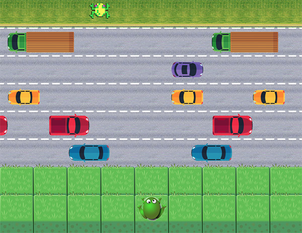

# "F-ROGER" : Classic Arcade Game Clone Project 

1. The player is a frog and needs to cross the road safely to the other side.
2. Catching his retro figure sends him to the next level.

## Table of Contents

  - [Features](#features)
  - [Instructions](#instructions)
  - [File System](#file-system)
  - [Code Explanation](#code-explanation)
  - [Game Engine](#game-engine)

## Features:

* Player can move one step at a time
* 4 different game levels
* Different winning spot per level
* Coded 'run-over' animation
* Easily create new [levels](#Example)

## Instructions:

- Navigate your way with the **up, down, left, right** arrow keys
- A car hit will send the player back to the safe zone
- Use the numbers (1-4) to skip between levels

## File System:

| Type       | Folder | Format         |
| :--------- | :----- | :------------- |
| HTML       | root   | index.html     |
| CSS        | \css   | style.css      |
| JavaScript | \js    | app.js         |
| Pictures   | \imges | sprite-name.png|
| Markdown   | root   | `README.md`    |

##  Code Explanation:


[Game Settings:](#Game-Settings)
```
    GAME_DATA
        rows
        sprites
        players
        edges
```
[Classes:](#Classes)
```
    Enemy
        engineOn()
        engineOff()
        update(dt)
        render()

        EnemyLeft
        EnemyRight
        Winner
    
    Player
        reset()
        update()
        render()
        handleInput(keyClick)
```
[Variables:](#Variables)
```
    allEnemies
    enemiesHolder
    levels
    player
```
[Functions:](#Functions)
```
    BuildLevel
    startGame(level)
    nextLevel(finishedLevel)
```
[Event Listeners:](#Event-Listeners)
```
    addEventListener
        keydown, keyup
        Keyboard Shortcuts
```

### **Game Settings:**

`GAME_DATA`

- `rows`: The locations on the y-axis (delta=83, matches the parameters from engine.js)
- `sprites`: Enemies sprits, Sprites width
- `player`: All the player sprites. Possible to add new player styles
- `edges`: The space used for the enemies movement (bigger than the canvas)
  - The canvas is set from 0 to 909 (9 blocks)

### **Classes:**

`Enemy`

Has location (x, y), speed, move/stop toggle. Methods:

- `engineOn()`: Start enemy moving
- `engineOff()`: Stop enemy moving (currently not used)
- `update(dt)`: Change x location according to the time-delta (from engine.js)
- `render()`: Draw enemy (using engine.js)

Subclasses:

  - `EnemyLeft`:  For enemies coming from left side
  - `EnemyRight`: For enemies coming from right side
  - `Winner`: *NOT* an enemy. This is the winning object for each level.
    
`Player`

Has location (x,y), sprites stock, move toggle. Methods:
- `reset()`
- `update()`: Note: using the [enemiesHolder](#Variables) object
  - Check collision of the player
  - For optimization - preforms the check only for its current row
  - Includes coded player animation of 4 frames + car animation
  - Call the [nextLvel](#Functions) function uppon reaching the winner object
- `render()`: Draw enemy (using the engine.js)
- `handleInput(keyClick)`: Moving the player

### **Variables:**

`allEnemies`

- One big array which contains all objects for [engine.js](#Game-Engine) to update/render
- Not including the player object

`enemiesHolder`

- Holds all enemies in an arrays, organized by row
- Helps the coliision check to not check every enemy every frame

`levels`

Keeps the data for the game levels. Each level by an object with the structure:
- Key = level name
- Value = level data
  - Two empty arrays (for the safe zone, rows 1+2)
  - Enemies structure per row:
    - *First* row number
    - *Second* enemies speed (in seconds to complete one screen)
    - *Third* array of intervals between enemies, in *%*
      - **0** refers to the one [edge](#Game-Settings), **100** refers to the other
- **UPADETE**: The first element of each level (e.x `level_#[0]`) is used for the decription of an alert box by the [function](#Functions) `startGame(level)`.

#### Example:

```
    level_3: [[],
        [],
        [2, 8, [35, 65, 95]],
        [3, 7, [10, 30, 70]],
        [4, 7, [20, 40, 80]],
        [5, 3, [60]],
        [6, 6, [30, 80]],
        [7, 180, [22]]
    ]
```

| Row | Speed (seconds) | Location 1 | Location 2 | Location 3 | Location 4... | Style *** |
| :---: | :---: | :--- | :--- | :--- | :--- |:--- |
| 7 | 3 minutes | 22% ** | - | - | - | Winning Spot |
| 6 | 6 | 30% | 80% | - | - | Enemy (Truck) |
| 5 | 3 | 60% | - | - | - | Enemy (Fast) |
| 4 | 7 |20% | 40% | 80% | - | Enemy Right |
| 3 | 7 | 10% | 30% | 70% | - | Enemy Left |
| 2 | 8 | 35% | 65% | 95% * | - | Enemy (Slow) |
| 1 | [ ] | - | - | - | - | - |
| 0 | [ ] | - | - | - | - | - |

`*` Note: The actual visible screen is between 8% to 82%. Therefore, enemy 3 on row 2 is off screen.

`**` The actual visible screen for the winner object is between 0% to 66%. Therfore, it will be located on 1/3 of the screen

`***` The **style** is just a helper and not part of the level data



### **Functions:**

`BuildLevel`

- Recieves a level by the above structure
- Transform the % intervals to real x-axis locations (new array)
- Create enemies, fit direction by row automatically
- Adds each enemy to the [enemiesHolder](#Variables)
- When reaches row 7 - creates the winning spot of the level
  
`startGame(level)`

- **UPDATE**: Alerting the player before starting each level, with a double line alert box (taken from the `levels` object)
- Reset the enemiesHolder
- Call the level builder function (creates the level)
- Transform all enemies to one array for the render method of engine.js
- Turn (vehicle) engines for all objects 
- Resets the player
  
`nextLevel(finishedLevel)`

- Compare the current level to the levels stock
- Create the next level
- Keeps the level name for track by the next winner object
- Finishes the game if needed (loads the game over level)

### **Event Listeners:**

`addEventListener`

- Using *allowMove* to prevent constant key press
- Send input to player or skip levels
  
  | Key | Action |
  |:---|:---|
  | 1 | Level 1 |
  | 2 | Level 2 |
  | 3 | Level 3 |
  | 4 | Level 4 |
  | 5 | Game Over |

#### Start The Game:

[startGame(levels['level_1']);](#"F-ROGER"-:-Classic-Arcade-Game-Clone-Project)

## Game Engine:

* The game engine is `engine.js`, for initializing, the canvas and rendering
* The game uses `resources.js` for caching images
* Both files are self explained with full comments inside the code
* Both of these files I **did not** code - I only changed few parameters.
  